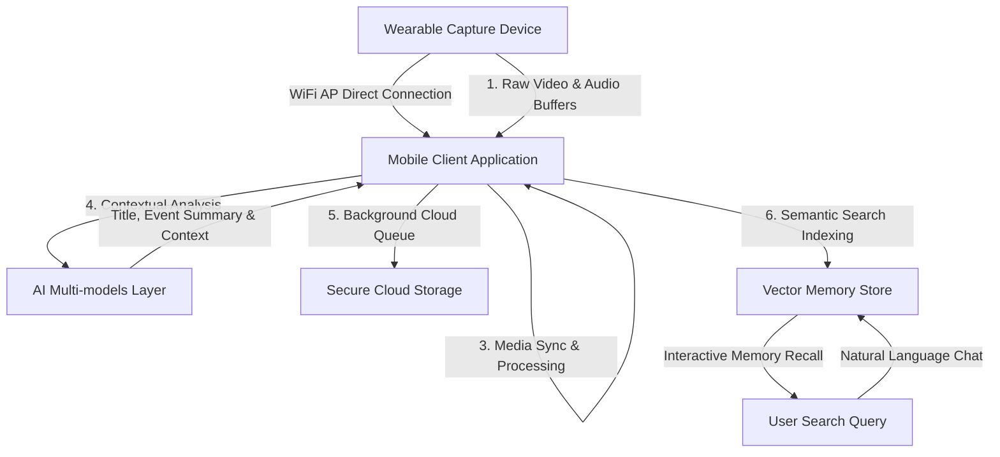

  
  
  # 🧠 SAGE — Personal Wearable Memory Capture System
  
  > **"People May Fade. Memories Shouldn't."**

  
  
  
  
  

  

---

## 1. SAGE
SAGE is an advanced **personal wearable memory capture system** that continuously documents, categorizes, and indexes your daily life events. By combining a low-power wearable capture unit with a cross-platform mobile application and a cloud storage syncing pipeline, SAGE helps you capture and recall daily experiences.

---

## 2. Problem
Every day, we are flooded with information, tasks, meetings, and visual details. Human memory is naturally fallible: we forget where we placed keys, lose track of action items from meetings, and fail to recall visual nuances from our daily routines. While digital devices capture high-volume data, they are not designed to catalog our lives in a structured, queryable, and hands-free manner.

---

## 3. Why SAGE
Traditional action cameras and audio recorders capture massive, raw, unindexed media files that require manual retrieval. SAGE bridges the gap by acting as a **cognitive co-processor**. It records short, synchronized chunks of our day, processes them in the background, and maps them to a semantic timeline. You don't have to scroll through hours of video; instead, you ask SAGE questions using natural language.

---

## 4. Vision
SAGE aims to create a secure, private, and personal retrieval system that augments human memory. By pairing hardware-accelerated local buffer capture with semantic search engines, SAGE acts as a personal memory assistant that gives users full ownership over their captured experiences.

---

## 5. Objectives
*   **Continuous Hands-Free Capture:** Capture synchronized 15-second visual and auditory segments without user intervention.
*   **Automated Offloading:** Establish secure peer-to-peer wireless connections to transfer media buffers to the phone.
*   **Real-time Timeline Construction:** Parse visual content and audio transcripts to build an interactive chronological event timeline.
*   **Conversational Search:** Enable semantic retrieval of personal events via conversational natural language queries.

---

## 6. How SAGE Works
1.  **Capture Cycle:** The wearable device records 15 seconds of video and audio directly into high-speed local memory buffers.
2.  **Wireless Sync:** When a recording completes, the mobile application connects to the device's local Access Point, downloads both streams in parallel, and merges them.
3.  **AI Analysis:** The client processes the media to generate a descriptive title, a concise event summary, and a detailed visual prompt.
4.  **Timeline & Sync:** The app logs the event in the local timeline and synchronizes the files to the user's private cloud.
5.  **Interactive Retrieval:** The user queries the system using text or voice, and SAGE searches the timeline, returning answers alongside direct links to the recorded video.

---

## 7. System Architecture

For a detailed breakdown of SAGE's components and architectural tiers, see [docs/architecture/architecture-details.md](file:///c:/SAGE/docs/architecture/architecture-details.md).

---

## 8. Hardware
The wearable unit uses a low-power dual-core microcontroller configured for independent visual and auditory collection:
*   **Visual Sensor:** OV2640 VGA Camera.
*   **Auditory Sensor:** PDM digital microphone.
*   **Memory Management:** External PSRAM enabled for dual-buffer partitioning, allowing concurrent data collection.
*   **Communication:** Configured as a local Access Point hosting a REST and binary streaming web server.

For schematics and pin configurations, see [hardware/hardware-overview.md](file:///c:/SAGE/hardware/hardware-overview.md).

---

## 9. Technology Stack

### Hardware:
- **XIAO ESP32-S3 Sense**
- **OV2640 camera**
- **PDM microphone**
- **PSRAM**

### Mobile:
- **Flutter**
- **Android**

### AI:
- **Gemini**
- **Multimodal AI**
- **Semantic memory/retrieval**

### Backend:
- **FastAPI**

### Storage:
- **Google Drive API**
- **Local temporary cache**

### Connectivity:
- **Wi-Fi Access Point**
- **HTTP/REST communication**

### Memory:
- **Structured personal memories**
- **Semantic representations**
- **Retrieval-based context**

---

## 10. Core Features
*   **Decoupled Dual-Buffer Capturing:** Separates visual frame acquisition and PDM microphone capture into isolated memory buffers, preventing heap overflows.
*   **Automatic Transition Engine:** Moves between livestreaming and file synchronization loops, pausing active streams during download to maximize bandwidth.
*   **Synchronous Playback Muxing:** Decoupled visual frame indices and auditory seek positions are synchronized proportionally during playback.
*   **Background Sync Queue:** Transactional queue management system with MD5 verification and retry-on-disconnect logic.

---

## 11. Use Cases
1.  **Finding Misplaced Items:** Ask *"Where did I place my wallet?"* to retrieve the video clip showing where you last left it.
2.  **Meeting Recap:** Conversational retrieval of assignees and key tasks discussed in meetings.
3.  **Structured Daily Log:** Chronological review of daily activities with automatically generated titles and tags.

For scenarios and user flows, see [docs/use-cases/use-cases-details.md](file:///c:/SAGE/docs/use-cases/use-cases-details.md).

---

## 12. Methodology
The SAGE system uses an automated loop: **Capture (15s)** ➡️ **Transfer & Cache** ➡️ **Transition Scroll** ➡️ **30s Decision Window** ➡️ **Loop Repeat**. Decoupling buffer acquisition from media muxing allows the wearable device to remain lightweight, offloading the processing to the client app.

For more details on the media processing pipeline, see [docs/methodology/methodology-details.md](file:///c:/SAGE/docs/methodology/methodology-details.md) and [research/methodology.md](file:///c:/SAGE/research/methodology.md).

---

## 13. Literature Gap
Traditional wearable life-loggers face two major limits:
1.  **Memory Bottlenecks:** Microcontroller memory constraints prevent combined audio/video buffer storage.
2.  **Data Extraction Gaps:** Passive logging systems record hours of raw footage, making manual retrieval tedious.

SAGE solves these issues by partitioning the audio/video buffers into separate memory locations on the device, offloading processing, and using multimodal AI for semantic timeline indexing.

For the complete analysis, see [docs/gap-analysis/gap-details.md](file:///c:/SAGE/docs/gap-analysis/gap-details.md) and [research/gap-analysis.md](file:///c:/SAGE/research/gap-analysis.md).

---

## 14. Privacy & User Control
We believe in full user data ownership:
*   **Private Cloud Storage:** All media and logs are stored directly inside the user's private Google Drive storage, rather than third-party servers.
*   **Local Processing:** Summarization and indexing runs directly on-device using private API keys.
*   **Granular Controls:** Users can inspect, correct, or permanently delete memories directly from the app interface.

---

## 15. Current Status
*   **Firmware Loop:** Stable dual-channel capture and AP hosting implemented on the ESP 32 wearable.
*   **Mobile Application:** Automated sync loop, timeline browser, local transcode integration, and conversational chatbot are functional.
*   **AI Integration:** Multi-model pipeline is integrated and functional.

---

## 16. Future Scope
*   **On-Device Embeddings:** Transition semantic embedding generation from remote APIs to local on-device networks.
*   **Multi-Device Synchronization:** Enable coordinate-based cross-device memory recall.
*   **Thermal Optimization:** Further reduce heat dissipation during long active recording sessions.

---

## 17. Demo & Screenshots
*A visual demo of the active synchronization loop, the chronological memories browser, and the semantic recall chatbot will be displayed here.*

---

## 18. Research
*   [Literature Review](file:///c:/SAGE/research/literature-review.md) - Analysis of past wearable memory aids.
*   [Gap Analysis](file:///c:/SAGE/research/gap-analysis.md) - Focus on resource constraints and synchronization.
*   [Methodology](file:///c:/SAGE/research/methodology.md) - Engineering architecture of SAGE.

---

## 19. Contact

SAGE is built and maintained by **Vinayak Sharma**. All rights reserved.
For inquiries, please open a discussion on the GitHub repository page.
